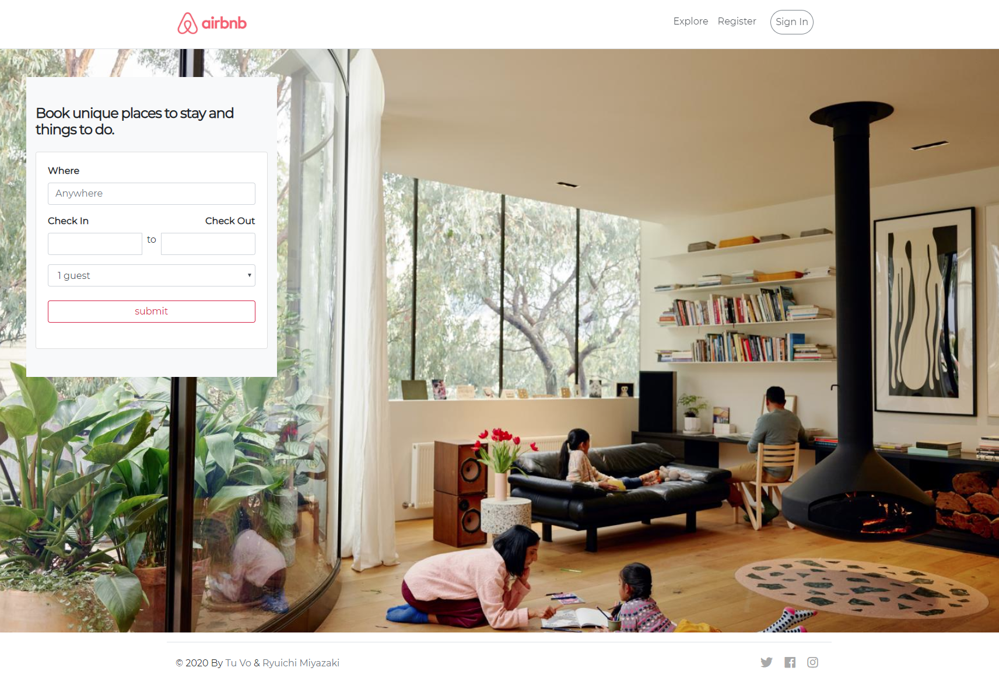
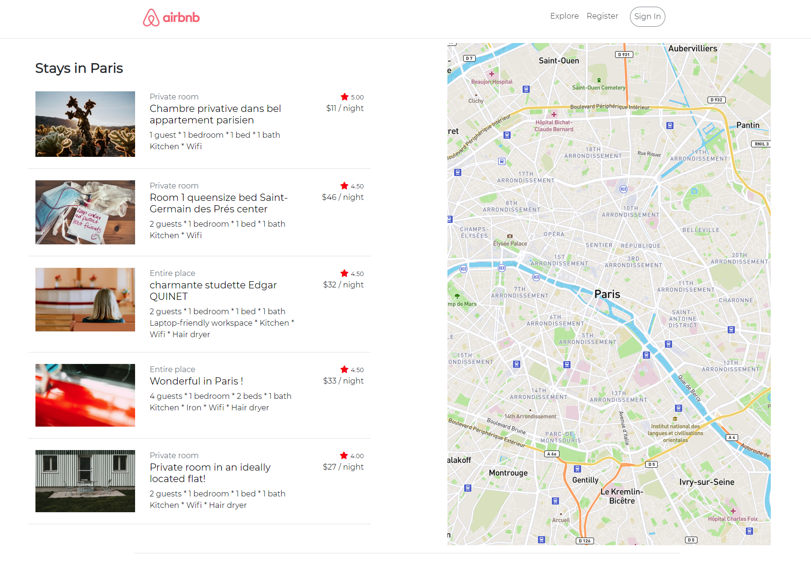
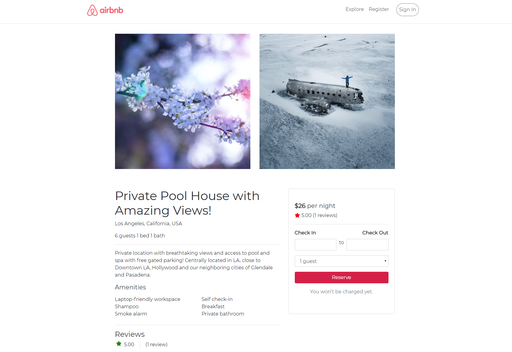

# Airbnb clone

This repository contains a Airbnb clone created with Python and Django.

## Table of Contents

- [Requirements](#requirements)
  - [Installation](#installation)
- [Views](#views)
- [Features](#features)
- [To Dos](#to-dos)
- [Special Thanks](#special-thanks)
- [Authors](#authors)

## Requirements

- Python 3.6+
- Django 3.0+

### Installation

- On your terminal, clone the repository with Git:

`git clone https://github.com/akatsuki-co/_airbnb.git`

- In order to install Python dependencies, run this command from the root of the repo:

`pip install -r requirements.txt`

- To run the dev server, use the following command:

`python3 manage.py runserver`

- Navigate to http://localhost:8000 to view our development site.

## Views

### Landing

### Explore

### City

### Detail

## To Dos

- Deploy app on Azure

## Authors

Created by:

- [Ryuichi Miyazaki](https://github.com/rmiyazaki6499)
- [Tu Vo](https://github.com/tuvo1106)

