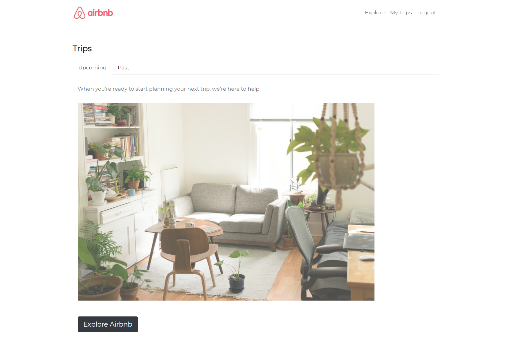
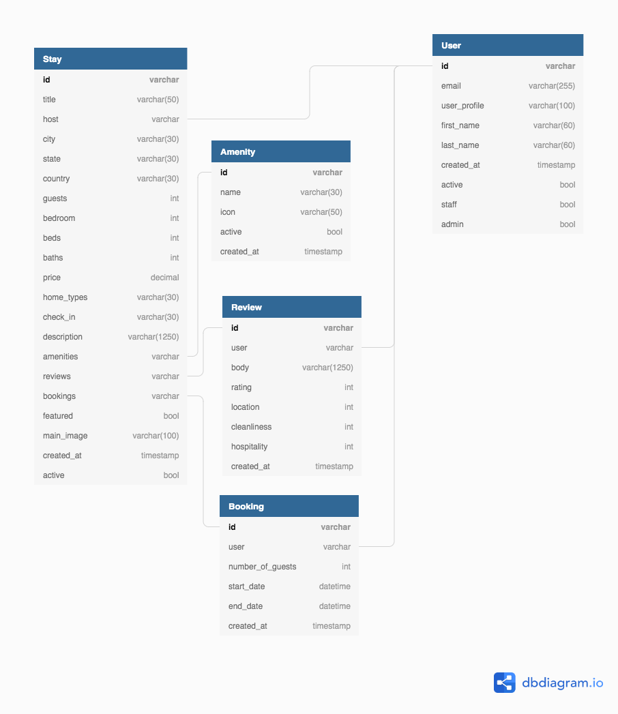

# Hygge Homes

This repository contains a full-stack web application to search and book vacation homes created with Python 3.6+, HTML and CSS.

What is Hygge? Hygge is a Danish and Norwegian word for a mood of coziness and comfortable conviviality with feelings of wellness and contentment.
This inspiration for this project is to create a site where users can search and find the perfect spot for their vacation home, much like Airbnb.

## Table of Contents

- [Tech Stack](#tech-stack)
- [Running the development server](#running-the-development-server)
- [Features](#features)
- [Views](#views)
- [Models](#models)
- [Status](#status)
- [Authors](#authors)

## Tech Stack
- Frontend libraries:
  - Bootstrap
  - Jquery
  - FontAwesome
  - Datepicker
- Backend framework
  - Django 3.0 and Jinja2
- Databases
  - SQLite (development)
  - PostgreSQL (production)
- Deployment
  - Amazon Web Services EC2 (Ubuntu 18.04)
  - Amazon Web Services Elastic IP

This is a portfolio project made by 2 computer science students who want to showcase our web development skills.

Ryuichi Miyazaki: [LinkedIn](https://www.linkedin.com/in/rmiyazaki/)

Tu Vo: [LinkedIn](https://www.linkedin.com/in/tu-vo/)

Check out our other projects at: [Akatsuki Co](https://github.com/akatsuki-co)


## Running the development server

For those that are interested in running the development server, we have containerized the project with Docker for convenience.

### Install Docker

To make this as easy as possible, we will be using *Docker Compose* to creat our container.

- If you do not have Docker yet, start by downloading it if you are on a Mac or Windows:
https://www.docker.com/products/docker-desktop

- Or if you are on a Linux Distribution follow the directions here:
https://docs.docker.com/compose/install/

- To confirm you have Docker Compose, open up your terminal and run the command below:

```
$ docker-compose --version
docker-compose version 1.26.2, build eefe0d31
```

### Build and Run the Container

- Clone the repo to your local machine:

```
$ git clone https://github.com/akatsuki-co/hyggehomes.git
```

- Go into the project directory to build and run the container with:

```
$ cd hyggehomes/
$ docker-compose up -d --build
```

Navigate to http://localhost:8000 to view the site on the local server.


- You can access your container with the command:

```
$ docker exec -it hyggehomes_hyggehomes_1 bash
```

This will take you into the bash session within the container.

### Cleaning up the Container and Image

To stop the container from running, use `<Ctrl-C>` twice.
To close down the container use the command:

```
$ docker-compose down
```
Then to clean up the container and image which we are no longer using use the command:

```
$ docker system prune -fa
```

Confirm that the container and image is no longer there with:

```
$ docker system df -v
```

## Features

Users can:

- register
- login
- view featured stays
- browse top cities
- search stays by city and/or location
- book stays

### API Integrations

#### Stripe

We accept and process credit card payments for bookings using Stripe's API.

#### Unsplash

Images for all of the stays are completely random and are rendered dynamically using Unsplash's API.

#### Mapbox

Maps of cities are rendered using Mapbox's API.

## Views

### Landing


### Explore


### City


### Detail


### My Trips



## Models

Our data has 5 schemas:

- Amenity
- Booking
- Review
- Stay
- User



### Relationships

A user has a one-to-many relationship to review, booking and stay.
A stay has a many-to-many relationship to amenity, review, and booking.

## Status

Project is complete and deployed!
Check it out here: https://hyggehomes.dev

## Authors

Created by:

- [Ryuichi Miyazaki](https://github.com/rmiyazaki6499)
- [Tu Vo](https://github.com/tuvo1106)
